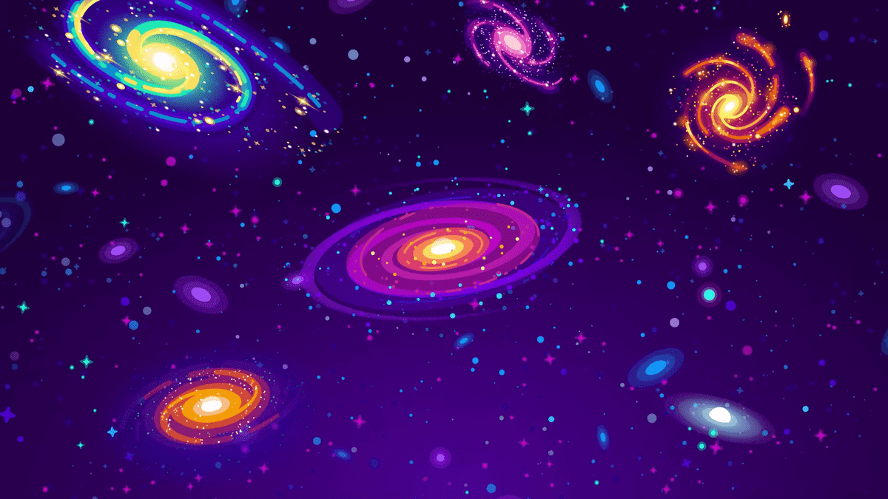

---
up:
  - "[Home](Home)"
related: 
created: 2023-12-10
tags: 
dg-publish: true
dg-home: true
---

Vũ trụ là hằng sa các mảnh thiên thể, các hành tinh, hố đen, ngôi sao, ... Tất cả đều liên tục biến đổi, hợp thành rồi lại tách ra, tan biến rồi lại xuất hiện, lặng im rồi bùng nổ, ... Tâm trí của con người cũng giống như vậy, liên tục biến đổi và phát triển. Và nó thật là một tác phẩm tuyệt diệu của đấng sáng tạo.

Các chủ đề tôi sẽ chia sẻ cho các bạn sẽ nằm trong thư mục `Atlas/Map`. Các mảnh kiến thức hình thành nên thế giới quan của tôi trải rộng trong thư mục `Atlas/Notes`. Chúng liên tục thay đổi, hợp thành, kéo vào rồi lại tách ra ,... giống như các thiên thể, hành tinh, hố đen, ... trong vũ trụ. Chúng luôn luôn được cập nhật, thay đổi và phát triển.

### Philosophy & Politics 📚
> [!kanban]+
> - [Marxism MOC](Maps/Marxism%20MOC.md)
> 	- ))))).jpg)
> - [Nationalism MOC](Nationalism%20MOC)
> 	- ))))).webp)
> - [International Relations MOC](International%20Relations%20MOC)
> 	- ))))).png)

### Computer 🖥️
> [!kanban]+ 
> - [Firefox MOC](Maps/Firefox%20MOC.md) 
> 	- ))))).jpg)
> - [Bí thuật MOC](Maps/Bí%20thuật%20MOC.md)
> 	- ))))).jpg)
> - [Obsidian MOC](Obsidian%20MOC)
> 	- ))))).png)

### Books 📔
> [!kanban]+ 
> - [Expose Books and Authors MOC](Expose%20Books%20and%20Authors%20MOC) 
> 	- ))))).jpg)
> - [Kiến thức căn bản về sách](Kiến%20thức%20căn%20bản%20về%20sách) 
> 	- (2))(2))(2))(2))(2))(2).jpg)

### Project ⌨️
