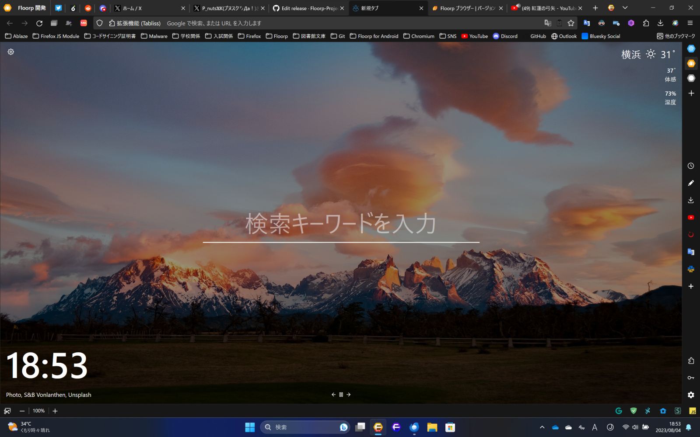

>[!Ship] Lợi ích của các bản mod:
>- **Tốc độ:** Firefox zin mặc định không được biên dịch (compile) bằng các tập lệnh tối ưu, mà thực tế ra được biên dịch bằng các tập lệnh tối ưu khiến Firefox mượt lên rất nhiều mà tier list là SSE > SSE2 > SSE3 > AVX2, nhược điểm là càng lên cao độ tương thích phần cứng càng giảm, yêu cầu các hệ máy mới hơn.
>- **Tính năng mới:** Tùy theo từng bản mod mà được tích hợp các tính năng hữu ích như Portable, ẩn địa chỉ IP, chống theo dõi...

## Cách nhảy các bản mod Firefox không lo mất dữ liệu

- Đầu tiên ở Firefox đang dùng, gõ `about:support` rồi xem phần `Application Binary`, mở thư mục chứa firefox. Exe lên
- Tải bản mod dạng nén như 7 z, zip, rar... Về rồi giải nén thẳng vào thư mục chứa firefox. Exe
- Nếu mở lên báo lỗi không tương thích thì vào folder profile xóa file `compatibility.ini` đi là xong

Khi nào chán muốn về Firefox thường thì vào [**ftp của Firefox**](https://ftp.mozilla.org/pub/firefox/releases/) tải file Firefox Setup_phiên bản.exe về rồi giải nén bằng Winrar Winzip rồi chép đè vào thư mục trên là về như cũ.

## Các bản mod phổ biến của Firefox

>[!Attention]
>*Privacy* = Riêng tư
*Portable* = Không cần cài đặt, không để lại rác, cho vào USB/mang sang máy khác giữ 100% dữ liệu
*Adblock* = Chặn quảng cáo dạng native
*SSE2/AVX/LTO* (các từ khóa đầu tiên) = Tập lệnh tăng tốc biên dịch

### Firefox Tete 009 - SSE2/AVX2 + Portable

Nếu như nói tới bản mod uy tín và lâu đời nhất, không thể không nói tới tete 009, bản mod này được biên dịch tối ưu bằng tập lệnh SSE 2 nên tương thích với đa phần hệ máy thời nay, giúp tăng tốc độ xử lý so với Firefox thường, ngoài ra tác giả áp dụng rất nhiều lệnh tối ưu PGO trong suốt mấy chục năm trời nên nhìn chung về độ uy tín và an toàn là không có gì bản. 

Hiện tại (14/9/2023) Tete đã chính thức lên kệ AVX2

Ngoài ra một điểm mạnh nữa của tete là bản này là bản stable nhưng lại là Nightly, nên nó có thể cài được Fastforward, Multi-Threaded Download Manager và [**iMacros**](https://voz.vn/t/tong-hop-nhung-addon-chat-cho-firefox-pc-mobile.682181/post-25694592)
  
**Download:**  
**Folder chứa các bản cũ (có cả 32 bit):** [https://drive.google.com/drive/folders/0BwJVYWis62cRalRwX2tsZklqUkk](https://drive.google.com/drive/folders/0BwJVYWis62cRalRwX2tsZklqUkk)

>[!Note]
>**Cách đặt Tete thành Firefox Portable xịn Pin được, đặt Default Browser được: [kiến thức - Tổng hợp những addon chất cho Firefox / Chromium | Page 32 | VOZ](https://voz.vn/t/tong-hop-nhung-addon-chat-cho-firefox-pc-mobile.682181/post-23354773)
> 
> Cách đặt Tete Portable thành Default Browser: [kiến thức - Tổng hợp những addon chất cho Firefox / Chromium | Page 80 | VOZ](https://voz.vn/t/tong-hop-nhung-addon-chat-cho-firefox-pc-mobile.682181/post-24612099)

### Floorp - LTO + Portable + Workspace + Sidebar + Unloadtab +...
>[!Note]
>Mình đang xài bản này, các thím có thể thử  

Bản Firefox mod của tác giả người Nhật mới nổi thời gian gần đây [trên các trang Reddit như /r/browsers, /r/firefox](https://old.reddit.com/r/browsers/comments/15khfd3/tried_out_floorp/) bởi nó cũng khá là đặc sắc khi so với Firefox gốc, mà cái đặc sắc nằm ở:
- [Sidebar bên tay phải để mở nhanh các tính năng như bookmark, history, addons...](https://user-images.githubusercontent.com/73892113/256759864-a32b5f9c-8c59-4296-81f0-ecdb17b2568b.mp4) (native)
- Hỗ trợ giao diện đẹp như Lepton, Chrome, Edge (cứ vào Settings là thấy)
- [Ngủ đông tab giống Auto Tab Discard cơ mà tốt hơn vì nó unload nhiều hơn, và là native](https://voz.vn/t/tong-hop-nhung-addon-chat-cho-firefox-pc-mobile.682181/post-27083488)
- [Hỗ trợ tab dọc](https://user-images.githubusercontent.com/73892113/256753788-6842e1a1-f0b9-4b37-b5b7-820d0fe37b84.mp4) ([**native**](https://voz.vn/t/tong-hop-nhung-addon-chat-cho-firefox-pc-mobile.682181/post-27057109))
- [Hỗ trợ đổi phím tắt tùy ý](https://voz.vn/t/tong-hop-nhung-addon-chat-cho-firefox-pc-mobile.682181/post-27447182) (native)
- [Workspace giống Vivaldi để quản lý tab theo từng vùng một cho gọn, ví dụ chia ra cho: Công việc, Cá nhân, Ăn chơi...](https://blog.ablaze.one/wp-content/uploads/2023/08/%E3%83%AC%E3%82%B3%E3%83%BC%E3%83%87%E3%82%A3%E3%83%B3%E3%82%B0-2023-08-01-181253.mp4) (native) 
- [Tối ưu bằng tập lệnh PGO+LTO nên nhanh hơn cả tete (SSE2+PGO) và thậm chí Mercury (AVX)](SSE2+PGO)%20và%20thậm%20chí%20Mercury%20(AVX)) mà vẫn giữ nguyên tính tương thích với hệ máy cũ chứ không như AVX kén hệ máy mới
- Và nhiều tùy chỉnh nhỏ khác nữa rất khó liệt kê hết vì nói chung nó nằm trong Settings ấy...

**Download:** [https://github.com/Floorp-Projects/Floorp/releases](https://github.com/Floorp-Projects/Floorp/releases)
### Firefox Mercury - AVX2 + Privacy
Con này cực kỳ nhanh, nhưng có chút hơi ko tương thích với các máy đời cũ.

Tuy không lâu đời nhưng bản này được biên dịch dựa trên tập lệnh AVX 2, mà AVX 2 còn nhanh hơn cả SSE 2 nên khá phù hợp cho những bạn chỉ quan tâm tới tốc độ. Ngoài ra tác giả cũng bê nhiều cái tối ưu của Librewolf, FireDragon... là những bản mod khác về để thêm mắm thêm muối.
  
**Download:** [https://github.com/Alex313031/Mercury/releases](https://github.com/Alex313031/Mercury/releases)

### LibreWolf & Tor & Mullvad - Privacy

>[!Info]
Đây là bản Firefox tập trung vào bảo vệ sự riêng tư của người dùng, tắt sạch telemetry và bật các tính năng kháng tạo fingerprint (dấu vân tay) để khiến các trang như Google, Facebook... Không theo dõi được.  

Mullvad thì mặc định chặn quảng cáo với uBlock.  
  
Lưu ý là khi dùng các trình duyệt thuộc họ Privacy, hạn chế cài các addon chặn quảng cáo hay Userscript vì nó khiến trang web phát hiện ra mình dùng addon gì, từ đó khiến fingerprint không còn thuộc về đám đông nữa.  
  
**Đánh giá về mức độ ẩn danh + riêng tư:** 
1. Mullvad [(do dùng VPN và đã chứng tỏ là không bao giờ lưu log)](do%20dùng%20VPN%20và%20đã%20chứng%20tỏ%20là%20không%20bao%20giờ%20lưu%20log))
2. Tor [(bị FBI nằm vùng máy chủ và bắt như thường)](bị%20FBI%20nằm%20vùng%20máy%20chủ%20và%20bắt%20như%20thường))
3. LibreWolf = Firefox+Arkenfox (chỉ nên dùng cho nhu cầu riêng tư)

Vậy nên VPN mà không lưu log > Tor vì Tor có nhược điểm chết người là bị FBI nằm vùng, tạo ra các máy chủ giả mạo rồi dò ra chính xác vị trí địa lý rồi bế đi.

**Download:** 
- LibreWolf: [LibreWolf Browser (https://librewolf.net/)](https://librewolf.net/)
- Tor: [The Tor Project | Privacy & Freedom Online (https://www.torproject.org/download/)](https://www.torproject.org/download/)
- Mullvad: [Releases · mullvad/mullvad-browser (https://github.com/mullvad/mullvad-browser/releases)](https://github.com/mullvad/mullvad-browser/releases)

### r3dfox - Windows 7
Cho người dùng Windows 7, bản mod của Firefox nhưng mãi mãi hỗ trợ Windows 7.

**Dowload**: [Releases · Eclipse-Community/r3dfox](https://github.com/Eclipse-Community/r3dfox/releases/)

### Hellfire 
Trình duyệt Firefox nhanh nhất Hellfire hiện đã có cập nhập lớn và chia ra 3 phiên bản:  
- Missile: Nhanh nhất, tắt hết sandbox, riêng tư, bảo mật
- Lazer: Nhanh hơn Firefox, vẫn có Sandbox
- Debug: Chậm nhất, không dùng

**Download**: [GitHub - BVSHAI/HellFire: Highly Optimized Firefox](https://github.com/BVSHAI/HellFire)

### Ice Raven/Smart Cookie Web - Privacy+SideloadXPI+Androi
Hai bản mod đều hỗ trợ khả năng cài addon từ file XPI chứ không cần dùng `addons.mozilla.org`, giúp cài được những addon bị cấm như Bypass Paywall Clean.  
  
Riêng [**Smart Cookie Web**](https://voz.vn/t/tong-hop-nhung-addon-chat-cho-firefox-pc-mobile.682181/post-29280929) là một bản mod triển vọng bởi tác giả viết lại hoàn toàn giao diện (UI) giống Vivaldi, giúp tương lai có thể thêm những tính năng khoai môn mà UI Firefox không thêm được.

**Download**:
[Releases · fork-maintainers/iceraven-browser](https://github.com/fork-maintainers/iceraven-browser/releases)
[Releases · CookieJarApps/SmartCookieWeb-Preview](https://github.com/CookieJarApps/SmartCookieWeb-Preview/releases)

### Waterfox - LT0/PO+Privacy+Betterfox+Androi
Đây cũng là một trong những bản Firefox mod lâu đời, ban đầu được sinh ra bởi Firefox hồi đó chưa có bản 64bit, nhưng sau này càng ngày càng nhiều đồ chơi và hiện tại , tiêu biểu nhất là `polyhedral optimisation` độc nhất vô nhị giúp tăng độ mượt khi cuộn chuột và các tác vụ lặp.  
  
Một trong những bản mod hiếm hoi có cả PC và Android.

**Download**:
[Releases · WaterfoxCo/Waterfox](https://github.com/WaterfoxCo/Waterfox/releases)
[Waterfox: Privacy Web Browser - Apps on Google Play](https://play.google.com/store/apps/details?id=net.waterfox.android.release&hl=en_US)

### Slimbrowser - Adbloc+DownloadManager+Portable

SlimBrowser là một trong những bản mod đàng hoàng nhất của Firefox, đàng hoàng ở đây nghĩa là nó tự viết lấy tất cả tính năng chứ không cài addon vào rồi gọi là bản mod như nhiều bản mod khác (mà mình không bao giờ cho vào post này). 
  
Cái AdBlock mặc định cùi bắp, nên thay bằng uBlock, còn lại đều ngon. 
Có Portable Pin được như Tete 009. 
  
**Tính năng:**
- AdBlock built-in như Brave, tuy nhiên cùi bắp nên bỏ cài uBlock
- Download Manager có thể kéo link Youtube dễ dàng, tất nhiên chia luồng được như IDM (đáng tiền)
- Portable kiểu Pin được như Tete 009, có thể đặt mặc định để ép Discord, Zalo, Telegram... Mở vào nó (đáng tiền)
- Dịch thuật như Google Chrome (đáng tiền)
- Thời tiết (cùi bắp), nên tắt
- Upload ảnh không cần vào web (đáng tiền)
- Facebook (tàm tạm)

Với từng đấy tính năng trình duyệt này khá đáng thử *cho những người lười*, cài phát đủ tính năng xong không quan tâm tới addon nữa.  
  
**Download:** [https://www.slimbrowser.net/](https://www.slimbrowser.net/) 
  
### Pulse Browser - Sidebar
[Firefox + 2 Sidebar như Edge.](https://raw.githubusercontent.com/pulse-browser/assets/main/preview.png) 
  
**Download:** [https://github.com/pulse-browser/browser/releases](https://github.com/pulse-browser/browser/releases) 

---
>[!Important] **Source:**
>https://voz.vn/t/tong-hop-nhung-addon-chat-cho-firefox-pc-mobile.682181/post-24399298

